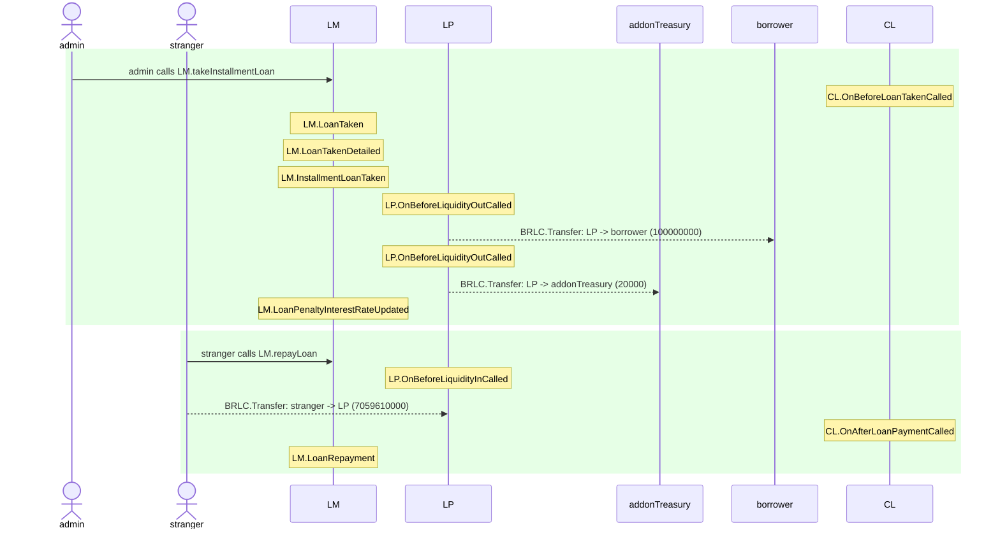
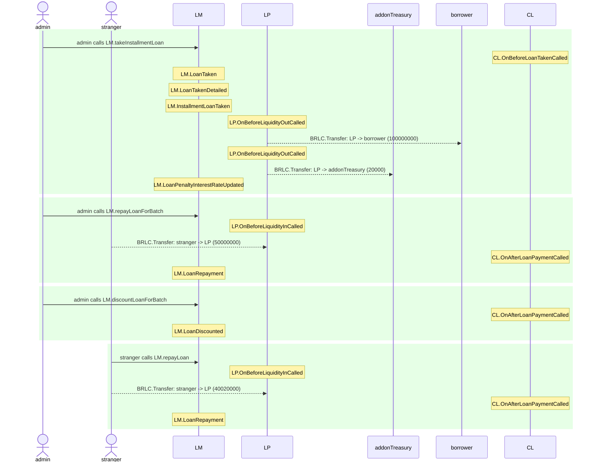

# LendingMarket.base.test

## Single-installment loan with the zero primary rate and some penalty rate that is fully repaid at the due date

| Idx | Caller | Contract | Name | Args |
| --- | ------ | -------- | ---- | ---- |
| 1 | admin | LM | takeInstallmentLoan | [borrower, 1, [100000000], [20000], [10], [500000000]] |
| 2 | stranger | LM | repayLoan | [0, 1157920892..3129639935] |


<details>
<summary>Step 0: LM.takeInstallmentLoan</summary>

- **type**: methodCall
- **caller**: admin
- **args**: `{
  "borrower": "borrower",
  "programId": "1",
  "borrowedAmounts": "[100000000]",
  "addonAmounts": "[20000]",
  "durationsInPeriods": "[10]",
  "penaltyInterestRates": "[500000000]"
}`

**Events**

| # | Contract | Event | Args |
| - | -------- | ----- | ---- |
| 1 | CL | OnBeforeLoanTakenCalled | `[0]` |
| 2 | LM | LoanTaken | `[0, borrower, 100020000, 10]` |
| 3 | LM | LoanTakenDetailed | `[0, borrower, 1, CL, LP, 100000000, 20000, 10, 0, 200000000]` |
| 4 | LM | InstallmentLoanTaken | `[0, borrower, 1, 1, 100000000, 20000]` |
| 5 | LP | OnBeforeLiquidityOutCalled | `[100000000]` |
| 6 | BRLC | Transfer | `[LP, borrower, 100000000]` |
| 7 | LP | OnBeforeLiquidityOutCalled | `[20000]` |
| 8 | BRLC | Transfer | `[LP, addonTreasury, 20000]` |
| 9 | LM | LoanPenaltyInterestRateUpdated | `[0, 500000000, 0]` |

**Balances**

**Token:** BRLC
| Holder | Balance |
| ------ | ------- |
| LM | 0 |
| LP | 1299899280000 |
| CL | 0 |
| BRLC | 0 |
| deployer | 0 |
| owner | 2000000000000 |
| borrower | 2700100000000 |
| stranger | 2000000000000 |
| admin | 0 |
| addonTreasury | 2000000720000 |


**extendedLoanPreviewWithoutTimestamps**
```
Object {
  "addonAmount": 20000n,
  "borrowedAmount": 100000000n,
  "borrower": "0x3C44CdDdB6a900fa2b585dd299e03d12FA4293BC",
  "discountAmount": 0n,
  "durationInPeriods": 10n,
  "firstInstallmentId": 0n,
  "installmentCount": 1n,
  "interestRatePrimary": 0n,
  "interestRateSecondary": 200000000n,
  "lateFeeAmount": 0n,
  "outstandingBalance": 100020000n,
  "penaltyBalance": 100020000n,
  "penaltyInterestRate": 500000000n,
  "programId": 1n,
  "repaidAmount": 0n,
  "trackedBalance": 100020000n,
}
```

</details>
<details>
<summary>Step 1: LM.repayLoan</summary>

- **type**: methodCall
- **caller**: stranger
- **args**: `{
  "loanId": "0",
  "repaymentAmount": "1157920892..3129639935"
}`

**Events**

| # | Contract | Event | Args |
| - | -------- | ----- | ---- |
| 1 | LP | OnBeforeLiquidityInCalled | `[100020000]` |
| 2 | BRLC | Transfer | `[stranger, LP, 100020000]` |
| 3 | CL | OnAfterLoanPaymentCalled | `[0, 100020000]` |
| 4 | LM | LoanRepayment | `[0, stranger, borrower, 100020000, 0]` |

**Balances**

**Token:** BRLC
| Holder | Balance |
| ------ | ------- |
| LM | 0 |
| LP | 1299999300000 |
| CL | 0 |
| BRLC | 0 |
| deployer | 0 |
| owner | 2000000000000 |
| borrower | 2700100000000 |
| stranger | 1999899980000 |
| admin | 0 |
| addonTreasury | 2000000720000 |


**extendedLoanPreviewWithoutTimestamps**
```
Object {
  "addonAmount": 20000n,
  "borrowedAmount": 100000000n,
  "borrower": "0x3C44CdDdB6a900fa2b585dd299e03d12FA4293BC",
  "discountAmount": 0n,
  "durationInPeriods": 10n,
  "firstInstallmentId": 0n,
  "installmentCount": 1n,
  "interestRatePrimary": 0n,
  "interestRateSecondary": 200000000n,
  "lateFeeAmount": 0n,
  "outstandingBalance": 0n,
  "penaltyBalance": 0n,
  "penaltyInterestRate": 500000000n,
  "programId": 1n,
  "repaidAmount": 100020000n,
  "trackedBalance": 0n,
}
```

</details>

## Single-installment loan with the zero primary rate and some penalty rate that is fully repaid one day after the due date

| Idx | Caller | Contract | Name | Args |
| --- | ------ | -------- | ---- | ---- |
| 1 | admin | LM | takeInstallmentLoan | [borrower, 1, [100000000], [20000], [10], [500000000]] |
| 2 | stranger | LM | repayLoan | [0, 1157920892..3129639935] |



<details>
<summary>Step 0: LM.takeInstallmentLoan</summary>

- **type**: methodCall
- **caller**: admin
- **args**: `{
  "borrower": "borrower",
  "programId": "1",
  "borrowedAmounts": "[100000000]",
  "addonAmounts": "[20000]",
  "durationsInPeriods": "[10]",
  "penaltyInterestRates": "[500000000]"
}`

**Events**

| # | Contract | Event | Args |
| - | -------- | ----- | ---- |
| 1 | CL | OnBeforeLoanTakenCalled | `[0]` |
| 2 | LM | LoanTaken | `[0, borrower, 100020000, 10]` |
| 3 | LM | LoanTakenDetailed | `[0, borrower, 1, CL, LP, 100000000, 20000, 10, 0, 200000000]` |
| 4 | LM | InstallmentLoanTaken | `[0, borrower, 1, 1, 100000000, 20000]` |
| 5 | LP | OnBeforeLiquidityOutCalled | `[100000000]` |
| 6 | BRLC | Transfer | `[LP, borrower, 100000000]` |
| 7 | LP | OnBeforeLiquidityOutCalled | `[20000]` |
| 8 | BRLC | Transfer | `[LP, addonTreasury, 20000]` |
| 9 | LM | LoanPenaltyInterestRateUpdated | `[0, 500000000, 0]` |

**Balances**

**Token:** BRLC
| Holder | Balance |
| ------ | ------- |
| LM | 0 |
| LP | 1299899280000 |
| CL | 0 |
| BRLC | 0 |
| deployer | 0 |
| owner | 2000000000000 |
| borrower | 2700100000000 |
| stranger | 2000000000000 |
| admin | 0 |
| addonTreasury | 2000000720000 |


**extendedLoanPreviewWithoutTimestamps**
```
Object {
  "addonAmount": 20000n,
  "borrowedAmount": 100000000n,
  "borrower": "0x3C44CdDdB6a900fa2b585dd299e03d12FA4293BC",
  "discountAmount": 0n,
  "durationInPeriods": 10n,
  "firstInstallmentId": 0n,
  "installmentCount": 1n,
  "interestRatePrimary": 0n,
  "interestRateSecondary": 200000000n,
  "lateFeeAmount": 0n,
  "outstandingBalance": 100020000n,
  "penaltyBalance": 100020000n,
  "penaltyInterestRate": 500000000n,
  "programId": 1n,
  "repaidAmount": 0n,
  "trackedBalance": 100020000n,
}
```

</details>
<details>
<summary>Step 1: LM.repayLoan</summary>

- **type**: methodCall
- **caller**: stranger
- **args**: `{
  "loanId": "0",
  "repaymentAmount": "1157920892..3129639935"
}`

**Events**

| # | Contract | Event | Args |
| - | -------- | ----- | ---- |
| 1 | LP | OnBeforeLiquidityInCalled | `[7059610000]` |
| 2 | BRLC | Transfer | `[stranger, LP, 7059610000]` |
| 3 | CL | OnAfterLoanPaymentCalled | `[0, 7059610000]` |
| 4 | LM | LoanRepayment | `[0, stranger, borrower, 7059610000, 0]` |

**Balances**

**Token:** BRLC
| Holder | Balance |
| ------ | ------- |
| LM | 0 |
| LP | 1306958890000 |
| CL | 0 |
| BRLC | 0 |
| deployer | 0 |
| owner | 2000000000000 |
| borrower | 2700100000000 |
| stranger | 1992940390000 |
| admin | 0 |
| addonTreasury | 2000000720000 |


**extendedLoanPreviewWithoutTimestamps**
```
Object {
  "addonAmount": 20000n,
  "borrowedAmount": 100000000n,
  "borrower": "0x3C44CdDdB6a900fa2b585dd299e03d12FA4293BC",
  "discountAmount": 0n,
  "durationInPeriods": 10n,
  "firstInstallmentId": 0n,
  "installmentCount": 1n,
  "interestRatePrimary": 0n,
  "interestRateSecondary": 200000000n,
  "lateFeeAmount": 115353144n,
  "outstandingBalance": 0n,
  "penaltyBalance": 0n,
  "penaltyInterestRate": 500000000n,
  "programId": 1n,
  "repaidAmount": 7059610000n,
  "trackedBalance": 0n,
}
```

</details>

## Single-installment loan with a non-zero primary rate and some penalty rate that is fully repaid at the due date

| Idx | Caller | Contract | Name | Args |
| --- | ------ | -------- | ---- | ---- |
| 1 | admin | LM | takeInstallmentLoan | [borrower, 1, [100000000], [20000], [10], [500000000]] |
| 2 | stranger | LM | repayLoan | [0, 1157920892..3129639935] |


<details>
<summary>Step 0: LM.takeInstallmentLoan</summary>

- **type**: methodCall
- **caller**: admin
- **args**: `{
  "borrower": "borrower",
  "programId": "1",
  "borrowedAmounts": "[100000000]",
  "addonAmounts": "[20000]",
  "durationsInPeriods": "[10]",
  "penaltyInterestRates": "[500000000]"
}`

**Events**

| # | Contract | Event | Args |
| - | -------- | ----- | ---- |
| 1 | CL | OnBeforeLoanTakenCalled | `[0]` |
| 2 | LM | LoanTaken | `[0, borrower, 100020000, 10]` |
| 3 | LM | LoanTakenDetailed | `[0, borrower, 1, CL, LP, 100000000, 20000, 10, 100000000, 200000000]` |
| 4 | LM | InstallmentLoanTaken | `[0, borrower, 1, 1, 100000000, 20000]` |
| 5 | LP | OnBeforeLiquidityOutCalled | `[100000000]` |
| 6 | BRLC | Transfer | `[LP, borrower, 100000000]` |
| 7 | LP | OnBeforeLiquidityOutCalled | `[20000]` |
| 8 | BRLC | Transfer | `[LP, addonTreasury, 20000]` |
| 9 | LM | LoanPenaltyInterestRateUpdated | `[0, 500000000, 0]` |

**Balances**

**Token:** BRLC
| Holder | Balance |
| ------ | ------- |
| LM | 0 |
| LP | 1299899280000 |
| CL | 0 |
| BRLC | 0 |
| deployer | 0 |
| owner | 2000000000000 |
| borrower | 2700100000000 |
| stranger | 2000000000000 |
| admin | 0 |
| addonTreasury | 2000000720000 |


**extendedLoanPreviewWithoutTimestamps**
```
Object {
  "addonAmount": 20000n,
  "borrowedAmount": 100000000n,
  "borrower": "0x3C44CdDdB6a900fa2b585dd299e03d12FA4293BC",
  "discountAmount": 0n,
  "durationInPeriods": 10n,
  "firstInstallmentId": 0n,
  "installmentCount": 1n,
  "interestRatePrimary": 100000000n,
  "interestRateSecondary": 200000000n,
  "lateFeeAmount": 0n,
  "outstandingBalance": 100020000n,
  "penaltyBalance": 100020000n,
  "penaltyInterestRate": 500000000n,
  "programId": 1n,
  "repaidAmount": 0n,
  "trackedBalance": 100020000n,
}
```

</details>
<details>
<summary>Step 1: LM.repayLoan</summary>

- **type**: methodCall
- **caller**: stranger
- **args**: `{
  "loanId": "0",
  "repaymentAmount": "1157920892..3129639935"
}`

**Events**

| # | Contract | Event | Args |
| - | -------- | ----- | ---- |
| 1 | LP | OnBeforeLiquidityInCalled | `[259430000]` |
| 2 | BRLC | Transfer | `[stranger, LP, 259430000]` |
| 3 | CL | OnAfterLoanPaymentCalled | `[0, 259430000]` |
| 4 | LM | LoanRepayment | `[0, stranger, borrower, 259430000, 0]` |

**Balances**

**Token:** BRLC
| Holder | Balance |
| ------ | ------- |
| LM | 0 |
| LP | 1300158710000 |
| CL | 0 |
| BRLC | 0 |
| deployer | 0 |
| owner | 2000000000000 |
| borrower | 2700100000000 |
| stranger | 1999740570000 |
| admin | 0 |
| addonTreasury | 2000000720000 |


**extendedLoanPreviewWithoutTimestamps**
```
Object {
  "addonAmount": 20000n,
  "borrowedAmount": 100000000n,
  "borrower": "0x3C44CdDdB6a900fa2b585dd299e03d12FA4293BC",
  "discountAmount": 0n,
  "durationInPeriods": 10n,
  "firstInstallmentId": 0n,
  "installmentCount": 1n,
  "interestRatePrimary": 100000000n,
  "interestRateSecondary": 200000000n,
  "lateFeeAmount": 0n,
  "outstandingBalance": 0n,
  "penaltyBalance": 0n,
  "penaltyInterestRate": 500000000n,
  "programId": 1n,
  "repaidAmount": 259430000n,
  "trackedBalance": 0n,
}
```

</details>

## Single-installment loan with a non-zero primary rate and some penalty rate that is fully repaid one day after the due date

| Idx | Caller | Contract | Name | Args |
| --- | ------ | -------- | ---- | ---- |
| 1 | admin | LM | takeInstallmentLoan | [borrower, 1, [100000000], [20000], [10], [500000000]] |
| 2 | stranger | LM | repayLoan | [0, 1157920892..3129639935] |


<details>
<summary>Step 0: LM.takeInstallmentLoan</summary>

- **type**: methodCall
- **caller**: admin
- **args**: `{
  "borrower": "borrower",
  "programId": "1",
  "borrowedAmounts": "[100000000]",
  "addonAmounts": "[20000]",
  "durationsInPeriods": "[10]",
  "penaltyInterestRates": "[500000000]"
}`

**Events**

| # | Contract | Event | Args |
| - | -------- | ----- | ---- |
| 1 | CL | OnBeforeLoanTakenCalled | `[0]` |
| 2 | LM | LoanTaken | `[0, borrower, 100020000, 10]` |
| 3 | LM | LoanTakenDetailed | `[0, borrower, 1, CL, LP, 100000000, 20000, 10, 100000000, 200000000]` |
| 4 | LM | InstallmentLoanTaken | `[0, borrower, 1, 1, 100000000, 20000]` |
| 5 | LP | OnBeforeLiquidityOutCalled | `[100000000]` |
| 6 | BRLC | Transfer | `[LP, borrower, 100000000]` |
| 7 | LP | OnBeforeLiquidityOutCalled | `[20000]` |
| 8 | BRLC | Transfer | `[LP, addonTreasury, 20000]` |
| 9 | LM | LoanPenaltyInterestRateUpdated | `[0, 500000000, 0]` |

**Balances**

**Token:** BRLC
| Holder | Balance |
| ------ | ------- |
| LM | 0 |
| LP | 1299899280000 |
| CL | 0 |
| BRLC | 0 |
| deployer | 0 |
| owner | 2000000000000 |
| borrower | 2700100000000 |
| stranger | 2000000000000 |
| admin | 0 |
| addonTreasury | 2000000720000 |


**extendedLoanPreviewWithoutTimestamps**
```
Object {
  "addonAmount": 20000n,
  "borrowedAmount": 100000000n,
  "borrower": "0x3C44CdDdB6a900fa2b585dd299e03d12FA4293BC",
  "discountAmount": 0n,
  "durationInPeriods": 10n,
  "firstInstallmentId": 0n,
  "installmentCount": 1n,
  "interestRatePrimary": 100000000n,
  "interestRateSecondary": 200000000n,
  "lateFeeAmount": 0n,
  "outstandingBalance": 100020000n,
  "penaltyBalance": 100020000n,
  "penaltyInterestRate": 500000000n,
  "programId": 1n,
  "repaidAmount": 0n,
  "trackedBalance": 100020000n,
}
```

</details>
<details>
<summary>Step 1: LM.repayLoan</summary>

- **type**: methodCall
- **caller**: stranger
- **args**: `{
  "loanId": "0",
  "repaymentAmount": "1157920892..3129639935"
}`

**Events**

| # | Contract | Event | Args |
| - | -------- | ----- | ---- |
| 1 | LP | OnBeforeLiquidityInCalled | `[7059610000]` |
| 2 | BRLC | Transfer | `[stranger, LP, 7059610000]` |
| 3 | CL | OnAfterLoanPaymentCalled | `[0, 7059610000]` |
| 4 | LM | LoanRepayment | `[0, stranger, borrower, 7059610000, 0]` |

**Balances**

**Token:** BRLC
| Holder | Balance |
| ------ | ------- |
| LM | 0 |
| LP | 1306958890000 |
| CL | 0 |
| BRLC | 0 |
| deployer | 0 |
| owner | 2000000000000 |
| borrower | 2700100000000 |
| stranger | 1992940390000 |
| admin | 0 |
| addonTreasury | 2000000720000 |


**extendedLoanPreviewWithoutTimestamps**
```
Object {
  "addonAmount": 20000n,
  "borrowedAmount": 100000000n,
  "borrower": "0x3C44CdDdB6a900fa2b585dd299e03d12FA4293BC",
  "discountAmount": 0n,
  "durationInPeriods": 10n,
  "firstInstallmentId": 0n,
  "installmentCount": 1n,
  "interestRatePrimary": 100000000n,
  "interestRateSecondary": 200000000n,
  "lateFeeAmount": 115353144n,
  "outstandingBalance": 0n,
  "penaltyBalance": 0n,
  "penaltyInterestRate": 500000000n,
  "programId": 1n,
  "repaidAmount": 7059610000n,
  "trackedBalance": 0n,
}
```

</details>

## Single-installment loan with the zero primary rate and some penalty rate that is fully repaid at the due date but has a partial repayment and a discount at one day since start

| Idx | Caller | Contract | Name | Args |
| --- | ------ | -------- | ---- | ---- |
| 1 | admin | LM | takeInstallmentLoan | [borrower, 1, [100000000], [20000], [10], [500000000]] |
| 2 | admin | LM | repayLoanForBatch | [[0], [50000000], stranger] |
| 3 | admin | LM | discountLoanForBatch | [[0], [10000000]] |
| 4 | stranger | LM | repayLoan | [0, 1157920892..3129639935] |



<details>
<summary>Step 0: LM.takeInstallmentLoan</summary>

- **type**: methodCall
- **caller**: admin
- **args**: `{
  "borrower": "borrower",
  "programId": "1",
  "borrowedAmounts": "[100000000]",
  "addonAmounts": "[20000]",
  "durationsInPeriods": "[10]",
  "penaltyInterestRates": "[500000000]"
}`

**Events**

| # | Contract | Event | Args |
| - | -------- | ----- | ---- |
| 1 | CL | OnBeforeLoanTakenCalled | `[0]` |
| 2 | LM | LoanTaken | `[0, borrower, 100020000, 10]` |
| 3 | LM | LoanTakenDetailed | `[0, borrower, 1, CL, LP, 100000000, 20000, 10, 0, 200000000]` |
| 4 | LM | InstallmentLoanTaken | `[0, borrower, 1, 1, 100000000, 20000]` |
| 5 | LP | OnBeforeLiquidityOutCalled | `[100000000]` |
| 6 | BRLC | Transfer | `[LP, borrower, 100000000]` |
| 7 | LP | OnBeforeLiquidityOutCalled | `[20000]` |
| 8 | BRLC | Transfer | `[LP, addonTreasury, 20000]` |
| 9 | LM | LoanPenaltyInterestRateUpdated | `[0, 500000000, 0]` |

**Balances**

**Token:** BRLC
| Holder | Balance |
| ------ | ------- |
| LM | 0 |
| LP | 1299899280000 |
| CL | 0 |
| BRLC | 0 |
| deployer | 0 |
| owner | 2000000000000 |
| borrower | 2700100000000 |
| stranger | 2000000000000 |
| admin | 0 |
| addonTreasury | 2000000720000 |


**extendedLoanPreviewWithoutTimestamps**
```
Object {
  "addonAmount": 20000n,
  "borrowedAmount": 100000000n,
  "borrower": "0x3C44CdDdB6a900fa2b585dd299e03d12FA4293BC",
  "discountAmount": 0n,
  "durationInPeriods": 10n,
  "firstInstallmentId": 0n,
  "installmentCount": 1n,
  "interestRatePrimary": 0n,
  "interestRateSecondary": 200000000n,
  "lateFeeAmount": 0n,
  "outstandingBalance": 100020000n,
  "penaltyBalance": 100020000n,
  "penaltyInterestRate": 500000000n,
  "programId": 1n,
  "repaidAmount": 0n,
  "trackedBalance": 100020000n,
}
```

</details>
<details>
<summary>Step 1: LM.repayLoanForBatch</summary>

- **type**: methodCall
- **caller**: admin
- **args**: `{
  "loanIds": "[0]",
  "repaymentAmounts": "[50000000]",
  "repayer": "stranger"
}`

**Events**

| # | Contract | Event | Args |
| - | -------- | ----- | ---- |
| 1 | LP | OnBeforeLiquidityInCalled | `[50000000]` |
| 2 | BRLC | Transfer | `[stranger, LP, 50000000]` |
| 3 | CL | OnAfterLoanPaymentCalled | `[0, 50000000]` |
| 4 | LM | LoanRepayment | `[0, stranger, borrower, 50000000, 50020000]` |

**Balances**

**Token:** BRLC
| Holder | Balance |
| ------ | ------- |
| LM | 0 |
| LP | 1299949280000 |
| CL | 0 |
| BRLC | 0 |
| deployer | 0 |
| owner | 2000000000000 |
| borrower | 2700100000000 |
| stranger | 1999950000000 |
| admin | 0 |
| addonTreasury | 2000000720000 |


**extendedLoanPreviewWithoutTimestamps**
```
Object {
  "addonAmount": 20000n,
  "borrowedAmount": 100000000n,
  "borrower": "0x3C44CdDdB6a900fa2b585dd299e03d12FA4293BC",
  "discountAmount": 0n,
  "durationInPeriods": 10n,
  "firstInstallmentId": 0n,
  "installmentCount": 1n,
  "interestRatePrimary": 0n,
  "interestRateSecondary": 200000000n,
  "lateFeeAmount": 0n,
  "outstandingBalance": 50020000n,
  "penaltyBalance": 100030000n,
  "penaltyInterestRate": 500000000n,
  "programId": 1n,
  "repaidAmount": 50000000n,
  "trackedBalance": 50020000n,
}
```

</details>
<details>
<summary>Step 2: LM.discountLoanForBatch</summary>

- **type**: methodCall
- **caller**: admin
- **args**: `{
  "loanIds": "[0]",
  "discountAmounts": "[10000000]"
}`

**Events**

| # | Contract | Event | Args |
| - | -------- | ----- | ---- |
| 1 | CL | OnAfterLoanPaymentCalled | `[0, 10000000]` |
| 2 | LM | LoanDiscounted | `[0, 10000000, 40020000]` |

**Balances**

**Token:** BRLC
| Holder | Balance |
| ------ | ------- |
| LM | 0 |
| LP | 1299949280000 |
| CL | 0 |
| BRLC | 0 |
| deployer | 0 |
| owner | 2000000000000 |
| borrower | 2700100000000 |
| stranger | 1999950000000 |
| admin | 0 |
| addonTreasury | 2000000720000 |


**extendedLoanPreviewWithoutTimestamps**
```
Object {
  "addonAmount": 20000n,
  "borrowedAmount": 100000000n,
  "borrower": "0x3C44CdDdB6a900fa2b585dd299e03d12FA4293BC",
  "discountAmount": 10000000n,
  "durationInPeriods": 10n,
  "firstInstallmentId": 0n,
  "installmentCount": 1n,
  "interestRatePrimary": 0n,
  "interestRateSecondary": 200000000n,
  "lateFeeAmount": 0n,
  "outstandingBalance": 40020000n,
  "penaltyBalance": 90030000n,
  "penaltyInterestRate": 500000000n,
  "programId": 1n,
  "repaidAmount": 50000000n,
  "trackedBalance": 40020000n,
}
```

</details>
<details>
<summary>Step 3: LM.repayLoan</summary>

- **type**: methodCall
- **caller**: stranger
- **args**: `{
  "loanId": "0",
  "repaymentAmount": "1157920892..3129639935"
}`

**Events**

| # | Contract | Event | Args |
| - | -------- | ----- | ---- |
| 1 | LP | OnBeforeLiquidityInCalled | `[40020000]` |
| 2 | BRLC | Transfer | `[stranger, LP, 40020000]` |
| 3 | CL | OnAfterLoanPaymentCalled | `[0, 40020000]` |
| 4 | LM | LoanRepayment | `[0, stranger, borrower, 40020000, 0]` |

**Balances**

**Token:** BRLC
| Holder | Balance |
| ------ | ------- |
| LM | 0 |
| LP | 1299989300000 |
| CL | 0 |
| BRLC | 0 |
| deployer | 0 |
| owner | 2000000000000 |
| borrower | 2700100000000 |
| stranger | 1999909980000 |
| admin | 0 |
| addonTreasury | 2000000720000 |


**extendedLoanPreviewWithoutTimestamps**
```
Object {
  "addonAmount": 20000n,
  "borrowedAmount": 100000000n,
  "borrower": "0x3C44CdDdB6a900fa2b585dd299e03d12FA4293BC",
  "discountAmount": 10000000n,
  "durationInPeriods": 10n,
  "firstInstallmentId": 0n,
  "installmentCount": 1n,
  "interestRatePrimary": 0n,
  "interestRateSecondary": 200000000n,
  "lateFeeAmount": 0n,
  "outstandingBalance": 0n,
  "penaltyBalance": 0n,
  "penaltyInterestRate": 500000000n,
  "programId": 1n,
  "repaidAmount": 90020000n,
  "trackedBalance": 0n,
}
```

</details>

## Single-installment loan with the zero primary rate and some penalty rate that is fully repaid one day after the due date but has a partial repayment and a discount at one day since start

| Idx | Caller | Contract | Name | Args |
| --- | ------ | -------- | ---- | ---- |
| 1 | admin | LM | takeInstallmentLoan | [borrower, 1, [100000000], [20000], [10], [500000000]] |
| 2 | admin | LM | repayLoanForBatch | [[0], [50000000], stranger] |
| 3 | admin | LM | discountLoanForBatch | [[0], [10000000]] |
| 4 | stranger | LM | repayLoan | [0, 1157920892..3129639935] |


<details>
<summary>Step 0: LM.takeInstallmentLoan</summary>

- **type**: methodCall
- **caller**: admin
- **args**: `{
  "borrower": "borrower",
  "programId": "1",
  "borrowedAmounts": "[100000000]",
  "addonAmounts": "[20000]",
  "durationsInPeriods": "[10]",
  "penaltyInterestRates": "[500000000]"
}`

**Events**

| # | Contract | Event | Args |
| - | -------- | ----- | ---- |
| 1 | CL | OnBeforeLoanTakenCalled | `[0]` |
| 2 | LM | LoanTaken | `[0, borrower, 100020000, 10]` |
| 3 | LM | LoanTakenDetailed | `[0, borrower, 1, CL, LP, 100000000, 20000, 10, 0, 200000000]` |
| 4 | LM | InstallmentLoanTaken | `[0, borrower, 1, 1, 100000000, 20000]` |
| 5 | LP | OnBeforeLiquidityOutCalled | `[100000000]` |
| 6 | BRLC | Transfer | `[LP, borrower, 100000000]` |
| 7 | LP | OnBeforeLiquidityOutCalled | `[20000]` |
| 8 | BRLC | Transfer | `[LP, addonTreasury, 20000]` |
| 9 | LM | LoanPenaltyInterestRateUpdated | `[0, 500000000, 0]` |

**Balances**

**Token:** BRLC
| Holder | Balance |
| ------ | ------- |
| LM | 0 |
| LP | 1299899280000 |
| CL | 0 |
| BRLC | 0 |
| deployer | 0 |
| owner | 2000000000000 |
| borrower | 2700100000000 |
| stranger | 2000000000000 |
| admin | 0 |
| addonTreasury | 2000000720000 |


**extendedLoanPreviewWithoutTimestamps**
```
Object {
  "addonAmount": 20000n,
  "borrowedAmount": 100000000n,
  "borrower": "0x3C44CdDdB6a900fa2b585dd299e03d12FA4293BC",
  "discountAmount": 0n,
  "durationInPeriods": 10n,
  "firstInstallmentId": 0n,
  "installmentCount": 1n,
  "interestRatePrimary": 0n,
  "interestRateSecondary": 200000000n,
  "lateFeeAmount": 0n,
  "outstandingBalance": 100020000n,
  "penaltyBalance": 100020000n,
  "penaltyInterestRate": 500000000n,
  "programId": 1n,
  "repaidAmount": 0n,
  "trackedBalance": 100020000n,
}
```

</details>
<details>
<summary>Step 1: LM.repayLoanForBatch</summary>

- **type**: methodCall
- **caller**: admin
- **args**: `{
  "loanIds": "[0]",
  "repaymentAmounts": "[50000000]",
  "repayer": "stranger"
}`

**Events**

| # | Contract | Event | Args |
| - | -------- | ----- | ---- |
| 1 | LP | OnBeforeLiquidityInCalled | `[50000000]` |
| 2 | BRLC | Transfer | `[stranger, LP, 50000000]` |
| 3 | CL | OnAfterLoanPaymentCalled | `[0, 50000000]` |
| 4 | LM | LoanRepayment | `[0, stranger, borrower, 50000000, 50020000]` |

**Balances**

**Token:** BRLC
| Holder | Balance |
| ------ | ------- |
| LM | 0 |
| LP | 1299949280000 |
| CL | 0 |
| BRLC | 0 |
| deployer | 0 |
| owner | 2000000000000 |
| borrower | 2700100000000 |
| stranger | 1999950000000 |
| admin | 0 |
| addonTreasury | 2000000720000 |


**extendedLoanPreviewWithoutTimestamps**
```
Object {
  "addonAmount": 20000n,
  "borrowedAmount": 100000000n,
  "borrower": "0x3C44CdDdB6a900fa2b585dd299e03d12FA4293BC",
  "discountAmount": 0n,
  "durationInPeriods": 10n,
  "firstInstallmentId": 0n,
  "installmentCount": 1n,
  "interestRatePrimary": 0n,
  "interestRateSecondary": 200000000n,
  "lateFeeAmount": 0n,
  "outstandingBalance": 50020000n,
  "penaltyBalance": 100030000n,
  "penaltyInterestRate": 500000000n,
  "programId": 1n,
  "repaidAmount": 50000000n,
  "trackedBalance": 50020000n,
}
```

</details>
<details>
<summary>Step 2: LM.discountLoanForBatch</summary>

- **type**: methodCall
- **caller**: admin
- **args**: `{
  "loanIds": "[0]",
  "discountAmounts": "[10000000]"
}`

**Events**

| # | Contract | Event | Args |
| - | -------- | ----- | ---- |
| 1 | CL | OnAfterLoanPaymentCalled | `[0, 10000000]` |
| 2 | LM | LoanDiscounted | `[0, 10000000, 40020000]` |

**Balances**

**Token:** BRLC
| Holder | Balance |
| ------ | ------- |
| LM | 0 |
| LP | 1299949280000 |
| CL | 0 |
| BRLC | 0 |
| deployer | 0 |
| owner | 2000000000000 |
| borrower | 2700100000000 |
| stranger | 1999950000000 |
| admin | 0 |
| addonTreasury | 2000000720000 |


**extendedLoanPreviewWithoutTimestamps**
```
Object {
  "addonAmount": 20000n,
  "borrowedAmount": 100000000n,
  "borrower": "0x3C44CdDdB6a900fa2b585dd299e03d12FA4293BC",
  "discountAmount": 10000000n,
  "durationInPeriods": 10n,
  "firstInstallmentId": 0n,
  "installmentCount": 1n,
  "interestRatePrimary": 0n,
  "interestRateSecondary": 200000000n,
  "lateFeeAmount": 0n,
  "outstandingBalance": 40020000n,
  "penaltyBalance": 90030000n,
  "penaltyInterestRate": 500000000n,
  "programId": 1n,
  "repaidAmount": 50000000n,
  "trackedBalance": 40020000n,
}
```

</details>
<details>
<summary>Step 3: LM.repayLoan</summary>

- **type**: methodCall
- **caller**: stranger
- **args**: `{
  "loanId": "0",
  "repaymentAmount": "1157920892..3129639935"
}`

**Events**

| # | Contract | Event | Args |
| - | -------- | ----- | ---- |
| 1 | LP | OnBeforeLiquidityInCalled | `[6986170000]` |
| 2 | BRLC | Transfer | `[stranger, LP, 6986170000]` |
| 3 | CL | OnAfterLoanPaymentCalled | `[0, 6986170000]` |
| 4 | LM | LoanRepayment | `[0, stranger, borrower, 6986170000, 0]` |

**Balances**

**Token:** BRLC
| Holder | Balance |
| ------ | ------- |
| LM | 0 |
| LP | 1306935450000 |
| CL | 0 |
| BRLC | 0 |
| deployer | 0 |
| owner | 2000000000000 |
| borrower | 2700100000000 |
| stranger | 1992963830000 |
| admin | 0 |
| addonTreasury | 2000000720000 |


**extendedLoanPreviewWithoutTimestamps**
```
Object {
  "addonAmount": 20000n,
  "borrowedAmount": 100000000n,
  "borrower": "0x3C44CdDdB6a900fa2b585dd299e03d12FA4293BC",
  "discountAmount": 10000000n,
  "durationInPeriods": 10n,
  "firstInstallmentId": 0n,
  "installmentCount": 1n,
  "interestRatePrimary": 0n,
  "interestRateSecondary": 200000000n,
  "lateFeeAmount": 114153144n,
  "outstandingBalance": 0n,
  "penaltyBalance": 0n,
  "penaltyInterestRate": 500000000n,
  "programId": 1n,
  "repaidAmount": 7036170000n,
  "trackedBalance": 0n,
}
```

</details>

